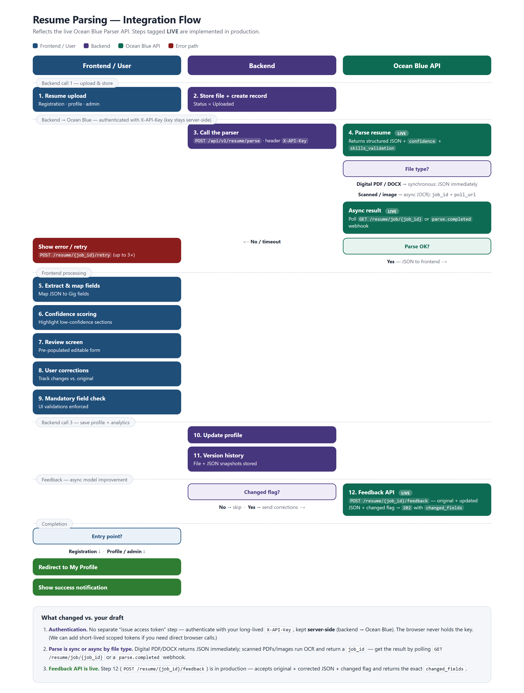

# Resume Parsing - Integration Flow (Ocean Blue API)

Swimlane view matching the original draft (Frontend / Backend / Ocean Blue), updated to
the **live** Ocean Blue Parser API. Steps marked **LIVE** are implemented in production.

**Send-ready image (vertical swimlane, matches the original layout):**



> The Mermaid block below is the editable source. To regenerate the PNG, paste it into
> [mermaid.live](https://mermaid.live) and export PNG/SVG - note it renders the lanes
> horizontally, so the vertical PNG above is the one to send.

```mermaid
flowchart LR
  classDef fe  fill:#1f4e79,stroke:#163a5c,color:#fff;
  classDef be  fill:#46367d,stroke:#332758,color:#fff;
  classDef ob  fill:#0e6b53,stroke:#0a4d3c,color:#fff;
  classDef err fill:#8c1d1d,stroke:#6a1414,color:#fff;
  classDef ok  fill:#2e7d32,stroke:#225626,color:#fff;
  classDef dec fill:#eef2f7,stroke:#5b6573,color:#1c2433;

  %% ===================== LANE 1: FRONTEND / USER =====================
  subgraph FE["Frontend / User"]
    direction TB
    U1["1. Resume upload<br/>Registration - profile - admin"]:::fe
    F5["5. Extract and map fields<br/>Map JSON to Gig fields"]:::fe
    F6["6. Confidence scoring<br/>Highlight low-confidence sections"]:::fe
    F7["7. Review screen<br/>Pre-populated editable form"]:::fe
    F8["8. User corrections<br/>Track changes vs. original"]:::fe
    F9["9. Mandatory field check<br/>UI validations enforced"]:::fe
    ERRN["Show error / retry<br/>POST /resume/job_id/retry"]:::err
    EP{"Entry point?"}:::dec
    MP["Redirect to My Profile"]:::ok
    DONE["Show success notification"]:::ok
    U1 ~~~ F5 --> F6 --> F7 --> F8 --> F9
  end

  %% ===================== LANE 2: BACKEND =====================
  subgraph BE["Backend"]
    direction TB
    B2["2. Store file + create record<br/>Status = Uploaded"]:::be
    B3["3. Call the parser<br/>POST /api/v1/resume/parse<br/>header X-API-Key (server-side)"]:::be
    B10["10. Update profile"]:::be
    B11["11. Version history<br/>File + JSON snapshots"]:::be
    CF{"Changed flag?"}:::dec
    B2 ~~~ B3
    B10 --> B11 --> CF
  end

  %% ===================== LANE 3: OCEAN BLUE API =====================
  subgraph OB["Ocean Blue API"]
    direction TB
    O4["4. Parse resume - LIVE<br/>JSON + confidence + skills_validation"]:::ob
    FT{"File type?"}:::dec
    SYNC["Synchronous<br/>JSON returned immediately"]:::ob
    ASYNC["Asynchronous (OCR) - LIVE<br/>job_id + poll_url"]:::ob
    POLL["Retrieve result - LIVE<br/>GET /resume/job/job_id<br/>or parse.completed webhook"]:::ob
    POK{"Parse OK?"}:::dec
    O12["12. Feedback API - LIVE<br/>POST /resume/job_id/feedback<br/>orig + updated JSON + changed -> 202"]:::ob
    O4 --> FT
    FT -->|"Digital PDF / DOCX"| SYNC --> POK
    FT -->|"Scanned / image"| ASYNC --> POLL --> POK
  end

  %% ===================== CROSS-LANE FLOW =====================
  U1 --> B2 --> B3 --> O4
  POK -->|"No / timeout"| ERRN
  ERRN -. retry .-> B3
  POK -->|"Yes - JSON to frontend"| F5
  F9 --> B10
  CF -->|"Yes"| O12
  CF -->|"No"| EP
  O12 --> EP
  EP -->|"Registration"| DONE
  EP -->|"Profile / admin"| MP --> DONE
```

<details><summary>Editable source (Mermaid)</summary>



</details>

## What changed vs. your draft

1. **Authentication.** There is no separate "issue access token" step. Authenticate to
   Ocean Blue with your long-lived `X-API-Key`, kept **server-side** (backend -> Ocean Blue).
   The browser never holds the key. *If you specifically need the browser to call us
   directly, we can add short-lived, scoped tokens - just say the word.*

2. **Parse is sync or async by file type.** Digital PDF/DOCX returns JSON immediately;
   scanned PDFs and images run OCR and return a `job_id` - retrieve the result by polling
   `GET /resume/job/{job_id}` or via a `parse.completed` webhook. (Added that branch.)

3. **Feedback API is live.** Step 12 (`POST /resume/{job_id}/feedback`) is implemented in
   production - it accepts the original and corrected JSON plus the changed flag and returns
   the exact `changed_fields`.

> Bonus already in the parse response: per-section `confidence` scores and
> `skills_validation` against the healthcare taxonomy.

---

### Rendering notes
- Renders on **GitHub** and **https://mermaid.live** (paste the ` ```mermaid ` block, then
  Actions -> export PNG/SVG to email them).
- True swimlanes use `flowchart LR` + a `subgraph` per lane with `direction TB`. The
  invisible links (`~~~`) just pin the first card to the top of its lane; remove them if
  your renderer doesn't support them.
